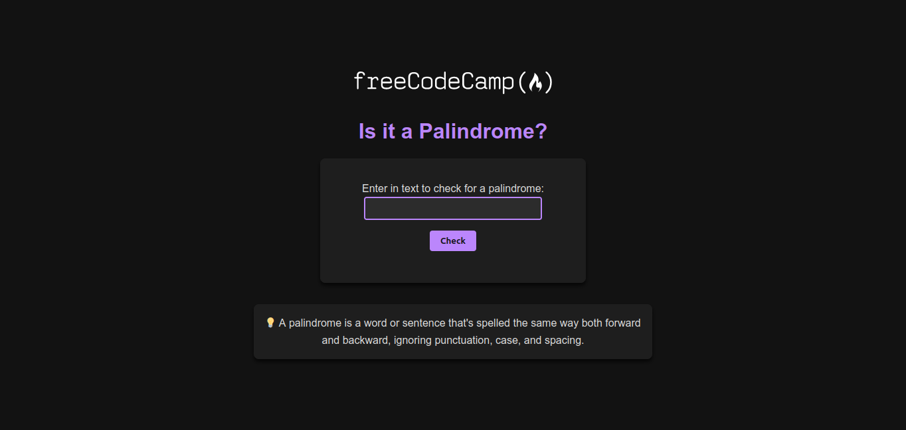

# Palindrome Checker

## Description

This project aims to check whether a word or phrase is a palindrome. A palindrome is a word or sentence that can be read the same way forwards and backwards, ignoring punctuation, spaces, and case.

This is a project required to complete the **JavaScript Algorithms and Data Structures** course from **freeCodeCamp**.

## Technologies Used

-  HTML
-  CSS
-  JavaScript

## Features

-  The user can input a text in the input field.
-  By clicking the "Check" button, the system checks whether the entered text is a palindrome.
-  The result is displayed below the input field, indicating whether the text is a palindrome or not.

## How to Use

1. Clone this repository or download the files.
2. Open the `index.html` file in your browser.
3. Type a text in the input box and click the "Check" button.
4. The result will be displayed below, showing whether the text is a palindrome or not.

## Example Input and Output

### Example 1:

-  **Input**: "A man, a plan, a canal, Panama"
-  **Output**: "A man, a plan, a canal, Panama is a palindrome"

### Example 2:

-  **Input**: "hello"
-  **Output**: "hello is not a palindrome"

## Project Screenshot



_The screenshot above shows the project's interface in action, with the input field and the check button._

## Installation

No installation is required. You can open the project directly in your browser.

1. Clone this repository:
   ```bash
   git clone https://github.com/YOUR_USERNAME/palindrome-checker.git
   ```
